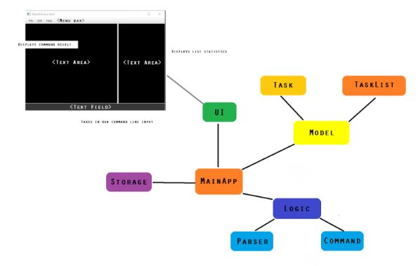
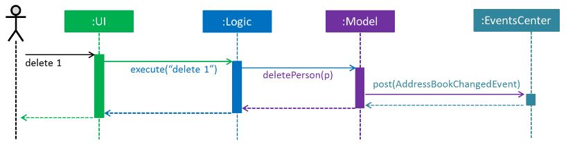
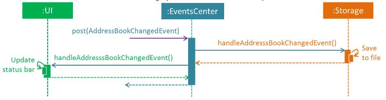
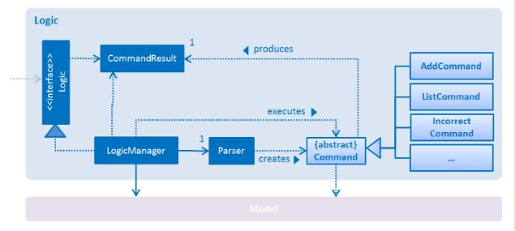
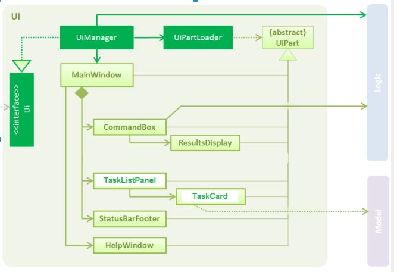
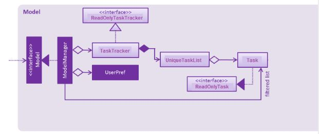
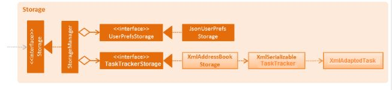

# Developer Guide 

##Table of Contents  
* [Setting Up](#setting-up)
* [Design](#design)
* [Implementation](#implementation)
* [Testing](#testing)
* [Dev Ops](#dev-ops)
* [Appendix A: User Stories](#appendix-a--user-stories)
* [Appendix B: Use Cases](#appendix-b--use-cases)
* [Appendix C: Non Functional Requirements](#appendix-c--non-functional-requirements)
* [Appendix D: Glossary](#appendix-d--glossary)
* [Appendix E : Product Survey](#appendix-e--product-survey)

## Setting up

### Prerequisites

1. **JDK `1.8.0_60`**  or later 

    > Having any Java 8 version is not enough.  
    This app will not work with earlier versions of Java 8.
    
2. **Eclipse** IDE
3. **e(fx)clipse** plugin for Eclipse (Do the steps 2 onwards given in
   [this page](http://www.eclipse.org/efxclipse/install.html#for-the-ambitious))
4. **Buildship Gradle Integration** plugin from the Eclipse Marketplace

### Importing the project into Eclipse

1. Fork this repo, and clone the fork to your computer
2. Open Eclipse (Note: Ensure you have installed the **e(fx)clipse** and **buildship** plugins as given in the prerequisites above)
3. Click `File` > `Import`
4. Click `Gradle` > `Gradle Project` > `Next` > `Next`
5. Click `Browse`, then locate the project's directory
6. Click `Finish`

  > * If you are asked whether to 'keep' or 'overwrite' config files, choose to 'keep'.
  > * Depending on your connection speed and server load, it can even take up to 30 minutes for the set up to finish
      (This is because Gradle downloads library files from servers during the project set up process)
  > * If Eclipse auto-changed any settings files during the import process, you can discard those changes.
  
### Troubleshooting project setup

**Problem: Eclipse reports compile errors after new commits are pulled from Git**
>Reason: Eclipse fails to recognize new files that appeared due to the Git pull. 
 
**Solution:** Refresh the project in Eclipse:  
  Right click on the project (in Eclipse package explorer), choose `Gradle` -> `Refresh Gradle Project`.  
**Problem: Eclipse reports some required libraries missing**
>Reason: Required libraries may not have been downloaded during the project import. 

**Solution:** [Run tests using Gradle](UsingGradle.md) once (to refresh the libraries).
 

## Design

The **_Architecture Diagram_** given below explains the high-level design of the App, showing which components interact with which other components. 
 
Given below is a quick overview of each component.
 
####Main
`Main` has only one class called [`MainApp`](). It is responsible for:
* At app launch: Initializes the components in the correct sequence, and connect them up with each other.
* At shut down: Shuts down the components and invoke cleanup method where necessary.

####Commons
[`Commons`]() represents a collection of classes used by multiple other components.
Two of those classes play important roles at the architecture level:
* `EventsCentre` : This class (written using [Google's Event Bus library](https://github.com/google/guava/wiki/EventBusExplained))
  is used by components to communicate with other components using events (a form of _Event Driven_ design)
* `LogsCenter` : Used by many classes to write log messages to the App's log file.
  
The rest of the App consists four components.
* [**`UI`**](#ui-component) : The UI of tha App.
* [**`Logic`**](#logic-component) : The command executor.
* [**`Model`**](#model-component) : Holds the data of the App in-memory.
* [**`Storage`**](#storage-component) : Reads data from, and writes data to, the hard disk.
Each of the four components
* Defines its _API_ in an `interface` with the same name as the Component.
* Exposes its functionality using a `{Component Name}Manager` class.

The _Sequence Diagram_ below shows how the components interact for the scenario where the user issues the
command `delete 3`.

>Note how the `Model` simply raises a `AddressBookChangedEvent` when the Address Book data are changed,instead of asking the `Storage` to save the updates to the hard disk.

The diagram below shows how the `EventsCenter` reacts to that event, which eventually results in the updates
being saved to the hard disk and the status bar of the UI being updated to reflect the 'Last Updated' time.  

> Note how the event is propagated through the `EventsCenter` to the `Storage` and `UI` without `Model` having
  to be coupled to either of them. This is an example of how this Event Driven approach helps us reduce direct 
  coupling between components.

The sections below give more details of each component.

####Logic
 
**API** : [`Logic.java`]()

1. `Logic` uses the `Parser` class to parse the user command.
2. This results in a `Command` object which is executed by the `LogicManager`.
3. The command execution can affect the `Model` (e.g. adding a person) and/or raise events.
4. The result of the command execution is encapsulated as a `CommandResult` object which is passed back to the `Ui`.

####UI
 

**API** : [`Ui.java`]()

The UI consists of a `MainWindow` that is made up of parts e.g.`CommandBox`, `ResultDisplay`, `PersonListPanel`,
`StatusBarFooter`, `BrowserPanel` etc. All these, including the `MainWindow`, inherit from the abstract `UiPart` class
and they can be loaded using the `UiPartLoader`.

The `UI` component uses JavaFx UI framework. The layout of these UI parts are defined in matching `.fxml` files
 that are in the `src/main/resources/view` folder. 
 For example, the layout of the [`MainWindow`]() is specified in
 [`MainWindow.fxml`]()

The `UI` component,
* Executes user commands using the `Logic` component.
* Binds itself to some data in the `Model` so that the UI can auto-update when data in the `Model` change.
* Responds to events raised from various parts of the App and updates the UI accordingly.

####Model
 

**API** : [`Model.java`]()

The `Model`,
* stores a `UserPref` object that represents the user's preferences.
* stores the task data.
* exposes a `UnmodifiableObservableList<ReadOnlyTask>` that can be 'observed' e.g. the UI can be bound to this list
  so that the UI automatically updates when the data in the list change.
* does not depend on any of the other three components.

#### Storage component

 

**API** : [`Storage.java`](../src/main/java/seedu/address/storage/Storage.java)

The `Storage` component,
* can save `UserPref` objects in json format and read it back.
* can save the Address Book data in xml format and read it back.

#### Common classes

The classes used by multiple components are in the `tasktracker.main.commons` package.

## Implementation

### Logging

We are using `java.util.logging` package for logging. The `LogsCenter` class is used to manage the logging levels
and logging destinations.

* The logging level can be controlled using the `logLevel` setting in the configuration file
  (See [Configuration](#configuration))
* The `Logger` for a class can be obtained using `LogsCenter.getLogger(Class)` which will log messages according to
  the specified logging level
* Currently log messages are output through: `Console` and to a `.log` file.

####Logging Levels

* `SEVERE` : Critical problem detected which may possibly cause the termination of the application
* `WARNING` : Can continue, but with caution
* `INFO` : Information showing the noteworthy actions by the App
* `FINE` : Details that is not usually noteworthy but may be useful in debugging
  e.g. print the actual list instead of just its size

### Configuration

Certain properties of the application can be controlled (e.g App name, logging level) through the configuration file 
(default: `config.json`)

## Dev Ops

### Build Automation

See [UsingGradle.md](UsingGradle.md) to learn how to use Gradle for build automation.

### Continuous Integration

We use [Travis CI](https://travis-ci.org/) to perform _Continuous Integration_ on our projects.
See [UsingTravis.md](UsingTravis.md) for more details.

### Making a Release

Here are the steps to create a new release.
 
 1. Generate a JAR file [using Gradle](UsingGradle.md#creating-the-jar-file).
 2. Tag the repo with the version number. e.g. `v0.1`
 2. [Crete a new release using GitHub](https://help.github.com/articles/creating-releases/) 
    and upload the JAR file your created.
   
### Managing Dependencies

A project often depends on third-party libraries. For example, Address Book depends on the
[Jackson library](http://wiki.fasterxml.com/JacksonHome) for XML parsing. Managing these _dependencies_
can be automated using Gradle. For example, Gradle can download the dependencies automatically, which
is better than these alternatives. 
    >   * Include those libraries in the repo (this bloats the repo size) 
    >   * Require developers to download those libraries manually (this creates extra work for developers) 
    
    
## Appendix A : User Stories

Priorities: High (must have) - `* * *`, Medium (nice to have)  - `* *`,  Low (unlikely to have) - `*`

Priority | As a ... | I want to ... | So that I 
-------- | :-------- | :--------- | :-----------
`* * *` | new user | have a user guide | can use the App easily.
`* * *` | user | access any part of the task manager by typing the correct command line in the GUI | do not need to rely on my mouse.
`* * *` | user | be able to delete tasks | remove tasks which are no longer needed.
`* * *` | user | access deleted tasks from the temporary trash bin | do not need to rewrite the same task later.
`* * *` | user | add tasks by simply typing it in the GUI | can store my tasks swiftly without hassle.
`* * *` | user | perform multiple undos on my actions | can revert back any changes.
`* * *` | user | check what tasks are scheduled for a specified date | can check what I have to do in advance. 
`* * *` | user | be reminded of upcoming tasks | do not miss deadlines.
`* * *` | user | set floating tasks which require no particular on days | can manage low priority tasks.
`* * *` | user | be able to see the tasks which I already have completed | can keep track of my progress. 
`* * *` | user | have quick loading of my task manager | will not be frustrated due to the loading.
`* * *` | user | be able to access my files offline | need not be burdened by unstable wifi connections.
`* * *` | user | be notified if there is a clash in my schedule upon inputting a new task | can keep my schedule balanced. 
`* *` | user | use the autocomplete function in the command line | can input commands more efficiently.
`* *` | user | highlight different tasks different colours based on the priorities I wish to give them | am more aware of the importance of each tasks.
`* *` | user | organize the tasks by dates | know which tasks are more urgent.
`* *` | user | set priority levels on different tasks | know which tasks need my attention more urgently.
`* *` | user | transfer data between different computers | can keep my work in sync.
`* *` | user | be able to search for specific tasks by name | do not need to go through all the tasks to find the one I need.
`* *` | user | get suggestions on available time slots when I am making plans | can schedule my events more easily.
`* *` | user | have similar commands to be displayed if I input a command incorrectly | can recognize what command I actually wanted to type.
`*` | user | change the colour of my text in the GUI | can have a more personal touch on the interface I am using.
`*` | user | refer to an in-built bot for instructions on how to use the task manager | won’t be lost. 
`*` | user | always see the current time and date on the screen | can manage the tasks I need to do today effectively.
`*` | user | be able to create aliases | can customize and enter frequently used commands easily.
`*` | user | be able to create multiple user profiles for the software | have many people using the app on the same PC.

## Appendix B : Use Cases

(For all use cases below, the **System** is the `TaskTracker` and the **Actor** is the `user`, unless specified otherwise)

#### Use case: Delete Task

**MSS**

1. Navigate to the date you want by typing the date in Date format
2. Select task that you wish to delete in the designated date
3. Input "DELETE" to delete the task you want to delete which will then be sent to trash bin
Use case ends

**Extensions**

2a. The list is empty
> Use case ends

3a. The given index is invalid

> 3a1. TaskTracker shows an error message 
  Use case resumes at step 2

#### Use case: Access Trash Bin

**MSS**

1. Input "TRASHBIN" into the command line interface
2. You will then be directed to the trash bin window
Use case ends
 
#### Use case: Add Task

**MSS**

1. Navigate to the date you want to add a task by typing the date in DDMMYY format
2. You can choose the timeslot of the day via keyboard navigation
3. You can type in the required details for the task
4. Input "ADD" into command line interface to add the task to the list
5. The task will be added to the designated date and timeslot
Use case ends

**Extensions**

2a. The input parameters are invalid
> 2a1. TaskTracker shows an error message to prompt user to insert correct inputs
  Use case resumes at step 2

#### Use case: Undo Task

**MSS**

1. You will be able to undo tasks by pressing Ctrl+Z (at the same time)
2. Alternatively, you can also input "UNDO" to perform undo operations
Use case ends
 
**Extensions**

2a. No changes made in the app since the opening the app
> Use case ends

#### Use case: Check Schedule

**MSS**

1. Navigate to the date you want to check by typing the date in DDMMYY format
2. Inputs "CHECK"
3. A list to show all scheduled tasks of the day
Use case ends

**Extensions**

2a. The list is empty
> Use case ends

#### Use case: Completed Task List

**MSS**

1. Navigate to the date you want by typing the date in DDMMYY format
2. Input "COMPLETED"
3. A list is generated to show all completed task of the day
Use case ends

**Extensions**

2a. The list is empty
> Use case ends
