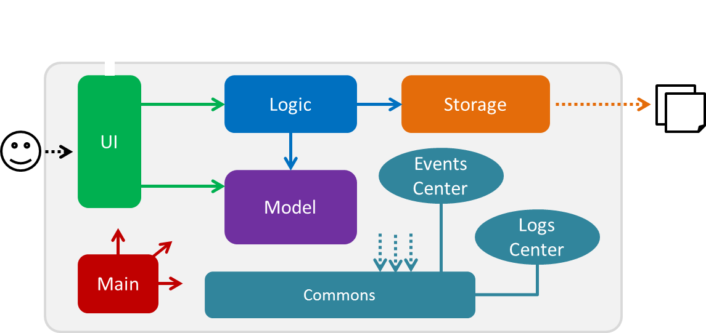
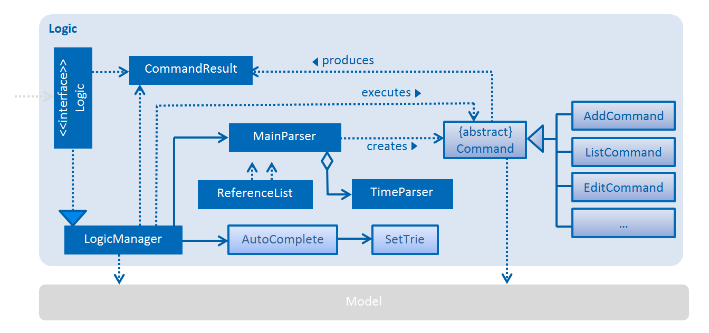
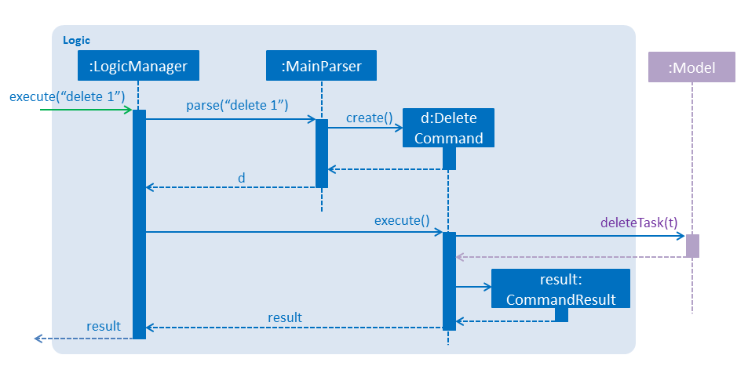
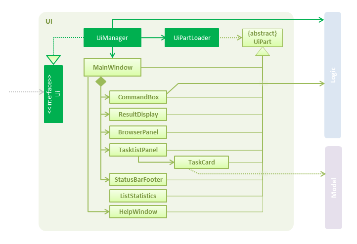
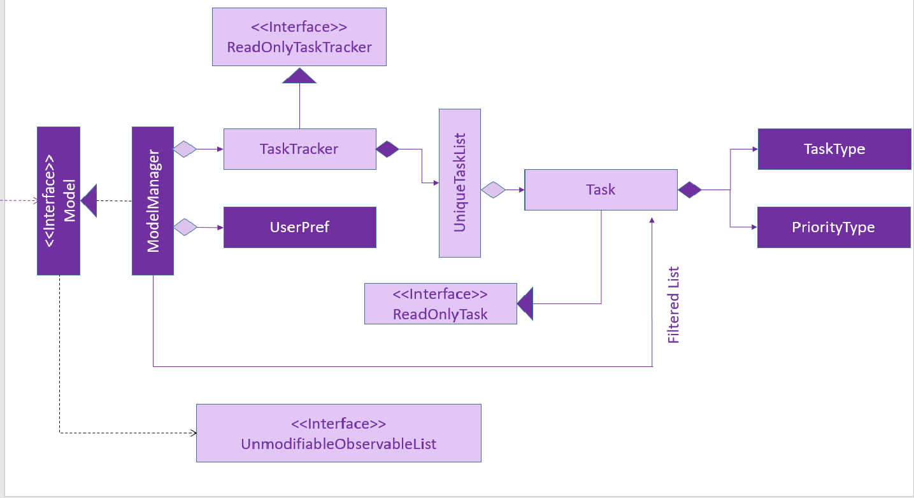
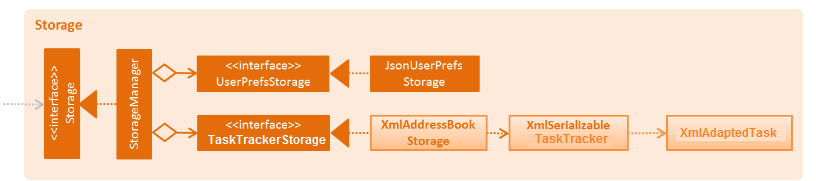
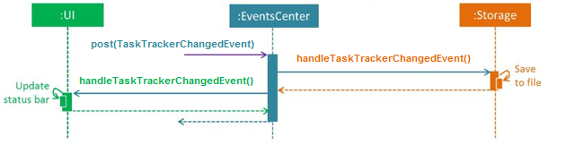

<!--@@author A0139422J -->
# Developer Guide 

##Table of Contents  
* [About](#about)
* [Setting Up](#setting-up)
* [Design](#design)
      * [Main](#main)
      * [Logic](#logic)
      * [UI](#ui)
      * [Model](#model)
      * [Storage](#storage)
      * [Commons](#commons)
* [Implementation](#implementation)
* [Testing](#testing)
* [Dev Ops](#dev-ops)
* [Appendix A: User Stories](#appendix-a--user-stories)
* [Appendix B: Use Cases](#appendix-b--use-cases)
* [Appendix C: Non Functional Requirements](#appendix-c--non-functional-requirements)
* [Appendix D: Glossary](#appendix-d--glossary)
* [Appendix E : Product Survey](#appendix-e--product-survey)

## About

### Overview
**Task Tracker (T-T)** is a java application which helps users to manage their tasks better. T-T is targeted at users who prefer typing over using a mouse. It provides an easy to use interface for these users; one which does not require any form of clicking.

### Purpose
This developer guide provides a general introduction and summary of the classes and components that are used within this application. The design of the software, together with its core functionalities will all be covered.  We invite prospective developers, especially students and amateur programmers, to read through this guide and help further develop this application.

### Level of Difficulty
The entire application employs a range of APIs and requires a deft understanding of:  
 * Java programming language 
     Since the core of code is written in Java, you have to be adept with the Java programming language.
 * JavaFX 
    Our user interface uses JavaFX, so being familiar with this platform will allow you to understand and edit it easily.

## Setting up

### Prerequisites

1. **JDK `1.8.0_60`**  or later 

    > Having any Java 8 version is not enough.  
    This app will not work with earlier versions of Java 8.
    
2. **Eclipse** IDE
3. **e(fx)clipse** plugin for Eclipse (Do the steps 2 onwards given in
   [this page](http://www.eclipse.org/efxclipse/install.html#for-the-ambitious))
4. **Buildship Gradle Integration** plugin from the Eclipse Marketplace

### Importing the project into Eclipse

1. Fork this repo, and clone the fork to your computer
2. Open Eclipse (Note: Ensure you have installed the **e(fx)clipse** and **buildship** plugins as given in the prerequisites above)
3. Click `File` > `Import`
4. Click `Gradle` > `Gradle Project` > `Next` > `Next`
5. Click `Browse`, then locate the project's directory
6. Click `Finish`

  > * If you are asked whether to 'keep' or 'overwrite' config files, choose to 'keep'.
  > * Depending on your connection speed and server load, it can even take up to 30 minutes for the set up to finish 
      (This is because Gradle downloads library files from servers during the project set up process)
  > * If Eclipse auto-changed any settings files during the import process, you can discard those changes.
  
### Troubleshooting project setup

**Why does Eclipse reports compile errors after new commits are pulled from Git?**
 > Eclipse failed to recognize the new files that appeared after Git pull. Refreshing the project in Eclipse may resolve this problem. Right click on the project (in Eclipse package explorer), choose `Gradle` -> `Refresh Gradle Project`.

**Why does Eclipse reports some required libraries are missing?**
 > Required libraries may not have been downloaded during the project import.  Run tests using Gradle once (to refresh the libraries). 

## Design

The **_Architecture Diagram_** given below explains the high-level design of the App, showing which components interact with which other components. 
 

T-T consists of six components:
 * `Main`
 * `UI`
 * `Logic` 
 * `Model`
 * `Storage`
 * `Commons`
For `UI`, `Logic`, `Model` and `Storage` components, its APIs are defined in an interface with the same name, and its functionality are exposed using a `{Component Name}Manager` class, such as `UIManager`.

Given below is a quick overview of each component.
 

#### Main
`Main` has only one class called [`Main`](https://github.com/CS2103AUG2016-T09-C3/main/blob/master/task-tracker/src/main/java/main/Main.java). It is responsible for:
* Launching app: Initializes the components in the correct sequence, and connect them up with each other.
* Shutting down: Shuts down the components and invoke cleanup method where necessary.

<!-- @@author A0144132W -->
#### Logic
[`Logic`](https://github.com/CS2103AUG2016-T09-C3/main/blob/master/task-tracker/src/main/java/main/logic/Logic.java) is exposed through [`LogicManager`](https://github.com/CS2103AUG2016-T09-C3/main/blob/master/task-tracker/src/main/java/main/logic/LogicManager.java), and consists of 3 main packages headed by the following classes, [`MainParser`](https://github.com/CS2103AUG2016-T09-C3/main/blob/master/task-tracker/src/main/java/main/logic/parser/MainParser.java), [`Command`](https://github.com/CS2103AUG2016-T09-C3/main/tree/master/task-tracker/src/main/java/main/logic/command) and [`AutoComplete`](https://github.com/CS2103AUG2016-T09-C3/main/blob/master/task-tracker/src/main/java/main/logic/autocomplete/AutoComplete.java). The Logic class diagram is shown below.
 
**API** : [`Logic.java`](https://github.com/CS2103AUG2016-T09-C3/main/tree/master/task-tracker/src/main/java/main/logic)

* `Logic` uses the `MainParser` class to parse the user command.
* `MainParser` class uses `TimeParser` to parse part of the input.
* `MainParser` returns a `Command` object which is executed by the `LogicManager`.
* Execution of `Command` object can affect the `Model` (e.g. adding a task) and/or raise events.
* The result of the command execution is encapsulated as a `CommandResult` object which is passed back to the `UI`.
* `AutoComplete` class is initialized by `Logic`, and reacts to certain events like when <kbd>tab</kbd> is pressed.
* `AutoComplete` uses `SetTrie` class to provide suggestions quickly.

Given below is the Sequence Diagram for interactions within the `Logic` component for the `execute("delete 1")`
 API call. 
 
`LogicManager` passes `MainParser` to input to parse, and gets back a `DeleteCommand` object which it executes to get a `CommandResult` object. `Model` is also edited in the process.

#### UI
[`UI`](https://github.com/CS2103AUG2016-T09-C3/main/blob/master/task-tracker/src/main/java/main/ui/Ui.java) is exposed through [`UIManager`](https://github.com/CS2103AUG2016-T09-C3/main/blob/master/task-tracker/src/main/java/main/ui/UiManager.java), and consists of a MainWindow, which is made up of [`CommandBox`](https://github.com/CS2103AUG2016-T09-C3/main/blob/master/task-tracker/src/main/java/main/ui/CommandBox.java), [`ResultDisplay`](https://github.com/CS2103AUG2016-T09-C3/main/blob/master/task-tracker/src/main/java/main/ui/ResultDisplay.java), [`TaskListPanel`](https://github.com/CS2103AUG2016-T09-C3/main/blob/master/task-tracker/src/main/java/main/ui/TaskListPanel.java), [`StatusBarFooter`](https://github.com/CS2103AUG2016-T09-C3/main/blob/master/task-tracker/src/main/java/main/ui/StatusBarFooter.java), [`ListStatistics`](https://github.com/CS2103AUG2016-T09-C3/main/blob/master/task-tracker/src/main/java/main/ui/ListStatistics.java) and [`HelpWindow`](https://github.com/CS2103AUG2016-T09-C3/main/blob/master/task-tracker/src/main/java/main/ui/HelpWindow.java). The UI class diagram is shown below. 
 

**API** : [`Ui.java`]()

* All individual UI sub components, including the `MainWindow`, inherit from the abstract `UiPart` class and they can be loaded using the `UiPartLoader`.
* JavaFx UI framework is used. 
* The layout of these UI parts are defined in matching `.fxml` files that are in the `src/main/resources/view` folder.  For example, the layout of the [`MainWindow`]() is specified in[`MainWindow.fxml`]()
* User commands are executed using the `Logic` component.
* UI auto-updates when data in the `Model` change.
* UI responds to events raised from various parts of the App, such as `Model` and updates itself accordingly.

#### Model
The `Model` component uses various classes to construct and model the data of TaskTracker in memory. [`ModelManager`](https://github.com/CS2103AUG2016-T09-C3/main/blob/master/task-tracker/src/main/java/main/model/ModelManager.java) implements [`Model`](https://github.com/CS2103AUG2016-T09-C3/main/blob/master/task-tracker/src/main/java/main/model/Model.java) interface, providing access to the model data as well as encapsulating the complexity of its in-built classes. All external components can only interact with the model data via the [`ModelManager`](https://github.com/CS2103AUG2016-T09-C3/main/blob/master/task-tracker/src/main/java/main/model/ModelManager.java) class.
 

**API** : [`Model.java`](https://github.com/CS2103AUG2016-T09-C3/main/blob/master/task-tracker/src/main/java/main/model/Model.java)

* `UserPref` object represents the user's preferences.
* Task data is stored in `TaskTracker` class.
* The task class models three different types of classes - floating, deadline and event tasks
* Each of these tasks contains certain fields specific to their own types
* `UnmodifiableObservableList<ReadOnlyTask>` is 'exposed', so list of tasks can be observed, for example by the `UI`, without being changed.

<!--@@author A0142686X -->
#### Storage
[`Storage`](https://github.com/CS2103AUG2016-T09-C3/main/blob/master/task-tracker/src/main/java/main/storage/Storage.java) is exposed through [`StorageManager`](https://github.com/CS2103AUG2016-T09-C3/main/blob/master/task-tracker/src/main/java/main/storage/StorageManager.java), and interacts with [`UserPrefsStorage`](https://github.com/CS2103AUG2016-T09-C3/main/blob/master/task-tracker/src/main/java/main/storage/UserPrefsStorage.java) and [`TaskTrackerStorage`](https://github.com/CS2103AUG2016-T09-C3/main/blob/master/task-tracker/src/main/java/main/storage/TaskTrackerStorage.java) interfaces. The functionalities of these 2 interfaces are exposed by the [`JsonUserPrefsStorage`](https://github.com/CS2103AUG2016-T09-C3/main/blob/master/task-tracker/src/main/java/main/storage/JsonUserPrefsStorage.java) and [`XmlTaskTrackerStorage`](https://github.com/CS2103AUG2016-T09-C3/main/blob/master/task-tracker/src/main/java/main/storage/XmlTaskTrackerStorage.java) respectively.
 

**API** : [`Storage.java`](../src/main/java/main/storage/Storage.java)

* `UserPref` objects and TaskTracker data are saved in json format and can be read back.
* Task data are saved in XML format and can be read back

#### Commons
[`Commons`](https://github.com/CS2103AUG2016-T09-C3/main/tree/master/task-tracker/src/main/java/main/commons) represents a collection of classes used by multiple other components. These classes are furthered separated into packages - `core`, `events`, `exceptions` and `utils`

* `core` - Essential classes used for implementation in different components of TaskTracker
* `events` - Classes that address and assist in event changes, mainly used by EventBus and EventManager
* `exceptions` - Consists of classes that handle exceptions that may occur in TaskTracker.
* `util` - Classes that provides additional utilities to assist in different components
  
Two of those classes play important roles at the architecture level:
* `EventsCentre` : This class (written using [Google's Event Bus library](https://github.com/google/guava/wiki/EventBusExplained))
  is used for interaction between componenets.(a form of _Event Driven_ design)
* `LogsCenter` : This class is used by many classes to write log messages to the App's log file.
  

The _Sequence Diagram_ below shows how the components interact for the scenario where the user issues the
command `delete 1`.  
  
>Note how the `Model` simply raises a `TaskTrackerChangedEvent` when the T-T data are changed,instead of asking the `Storage` to save the updates to the hard disk.

The diagram below shows how the `EventsCenter` reacts to that event, which eventually results in the updates
being saved to the hard disk and the status bar of the UI being updated to reflect the '**Last Updated**' time.  
  
> Note how the event is propagated through the `EventsCenter` to the `Storage` and `UI` without `Model` having
  to be coupled to either of them. This is an example of how this Event Driven approach helps us reduce direct 
  coupling between components.

## Implementation

### Logging

We are using `java.util.logging` package for logging. The `LogsCenter` class is used to manage the logging levels
and logging destinations.

* The logging level can be controlled using the `logLevel` setting in the configuration file
  (See [Configuration](#configuration))
* The `Logger` for a class can be obtained using `LogsCenter.getLogger(Class)` which will log messages according to
  the specified logging level
* Currently log messages are output through: `Console` and to a `.log` file.

####Logging Levels

* `SEVERE` : Critical problem detected which may possibly cause the termination of the application
* `WARNING` : Can continue, but with caution
* `INFO` : Information showing the noteworthy actions by the App
* `FINE` : Details that is not usually noteworthy but may be useful in debugging
  e.g. print the actual list instead of just its size

### Configuration

Certain properties of the application can be controlled (e.g App name, logging level) through the configuration file 
(default: `config.json`)

## Dev Ops

### Build Automation

See [UsingGradle.md](https://github.com/se-edu/addressbook-level4/blob/master/docs/UsingGradle.md) to learn how to use Gradle for build automation.

### Continuous Integration

We use [Travis CI](https://travis-ci.org/) to perform _Continuous Integration_ on our projects.
See [UsingTravis.md](https://github.com/se-edu/addressbook-level4/blob/master/docs/UsingTravis.md) for more details.

### Code Quality Evaluation

We use [Codacy](https://www.codacy.com/) to perform testing and evaluation on the code quality and report issues on our projects.

### Making a Release

Here are the steps to create a new release.
 
 1. Generate a JAR file [using Gradle](https://github.com/se-edu/addressbook-level4/blob/master/docs/UsingGradle.md#creating-the-jar-file).
 2. Tag the repository with the version number. e.g. `v0.1`
 2. [Create a new release using GitHub](https://help.github.com/articles/creating-releases/) 
    and upload the JAR file your created.

<!-- @@author A0139750B -->  
### Managing Dependencies

A project often depends on third-party libraries. For example, Task-Tracker Book depends on the
[Jackson library](http://wiki.fasterxml.com/JacksonHome) for XML parsing. Managing these _dependencies_
can be automated using Gradle. For example, Gradle can download the dependencies automatically, which is better than these alternatives. 
    >   * Include those libraries in the repo (this bloats the repo size) 
    >   * Require developers to download those libraries manually (this creates extra work for developers) 

## Testing 

Tests can be found in the ./src/test/java folder.

There are two types of tests:

**GUI Tests** - _System tests_ that test the entire application itself by stimulating user actions on the GUI. These tests are in ./src/test/java/guitests package.

**Non-GUI Tests** - Tests that does not involve GUI, namely:

* _Unit tests_ - tests that targets low level methods/classes 
		e.g src.test.java.commons.util.StringUtilTest
		
* _Integration Tests_ - Checks the integration of multiple code units (those code units are assumed to be working). 
		e.g src.test.java.storage.StorageManagerTest
		
* Hybrids of unit and integration tests - Tests that checks multiple code units as well as how they are connected together  
		e.g  src.test.java.logic.LogicManagerTest.java

**Headless GUI Testing** :
Thanks to the [TestFX](https://github.com/TestFX/TestFX) library that we are using, our GUI tests can be run in _headless_ mode. In the headless mode, GUI tests do not show up on the screen. That means the developer can do other things on his computer while the tests are running. 

See [UsingGradle.md](UsingGradle.md#running-tests) to learn how to run tests in headless mode
		
### Testing with Eclipse

* To run all tests, right-click on src/test/java folder and click `Run as` > `JUnit Test`

* You can also run tests individually or specific tests at one time, right-click on a test package, test class, or a test and choose to run as a JUnit test.

### Testing with Gradle

* See [UsingGradle.md](UsingGradle.md) for how to run tests using Gradle.
    
<!-- @@author A0144132W -->
## Appendix A : User Stories

Priorities: High (must have) - `* * *`, Medium (nice to have)  - `* *`,  Low (unlikely to have) - `*`

Priority | As a ... | I want to ... | So that I 
-------- | :-------- | :--------- | :-----------
`* * *` | new user | have a user guide | can use the App easily.
`* * *` | user | access any part of the task manager by typing the correct command line in the GUI | do not need to rely on my mouse.
`* * *` | user | be able to delete tasks | remove tasks which are no longer needed.
`* * *` | user | access deleted tasks from the temporary trash bin | do not need to rewrite the same task later.
`* * *` | user | add tasks by simply typing it in the GUI | can store my tasks swiftly without hassle.
`* * *` | user | perform multiple undos on my actions | can revert back any changes.
`* * *` | user | check what tasks are scheduled for a specified date | can check what I have to do in advance. 
`* * *` | user | be reminded of upcoming tasks | do not miss deadlines.
`* * *` | user | set floating tasks which require no particular on days | can manage low priority tasks.
`* * *` | user | be able to see the tasks which I already have completed | can keep track of my progress. 
`* * *` | user | have quick loading of my task manager | will not be frustrated due to the loading.
`* * *` | user | be able to access my files offline | need not be burdened by unstable wifi connections.
`* * *` | user | be notified if there is a clash in my schedule upon inputting a new task | can keep my schedule balanced. 
`* *` | user | use the autocomplete function in the command line | can input commands more efficiently.
`* *` | user | highlight different tasks different colours based on the priorities I wish to give them | am more aware of the importance of each tasks.
`* *` | user | organize the tasks by dates | know which tasks are more urgent.
`* *` | user | set priority levels on different tasks | know which tasks need my attention more urgently.
`* *` | user | transfer data between different computers | can keep my work in sync.
`* *` | user | be able to search for specific tasks by name | do not need to go through all the tasks to find the one I need.
`* *` | user | get suggestions on available time slots when I am making plans | can schedule my events more easily.
`* *` | user | have similar commands to be displayed if I input a command incorrectly | can recognize what command I actually wanted to type.
`*` | user | change the colour of my text in the GUI | can have a more personal touch on the interface I am using.
`*` | user | refer to an in-built bot for instructions on how to use the task manager | won’t be lost. 
`*` | user | always see the current time and date on the screen | can manage the tasks I need to do today effectively.
`*` | user | be able to create aliases | can customize and enter frequently used commands easily.
`*` | user | be able to create multiple user profiles for the software | have many people using the app on the same PC.

<!-- @@author A0139750B -->    
## Appendix B : Use Cases

(For all use cases below, the **System** is the `TaskTracker` and the **Actor** is the `user`, unless specified otherwise)

###Use case: Add Floating Task

**MSS**

1. User creates new task with no date and time
2. TaskTracker creates a floating task
Use case ends

**Extensions**

2a. The task description is null.
> 2a1. TaskTracker shows an error message 
> 2a2. User re-enters the task description 
> Use case resumes at step 2
  
2b. User creates a task with a priority
> 2b1. TaskTracker creates a floating task with the given priority 
> Use case ends

###Use case: Add Deadline Task

**MSS**

1. User creates new task with a deadline
2. TaskTracker creates a deadline task with the given deadline
Use case ends
 
**Extensions**

2a. The deadline only has a date (without a specific time)
> 2a1. TaskTracker creates a task with only a date without the time. 
> Use case ends

2b. User creates a task with a priority
> 2b1. TaskTracker creates a floating task with the given priority 
> Use case ends

###Use case: Add Event Task

**MSS**

1. User creates new task with a start time and an end time
2. TaskTracker creates a event task with the given start time and end time
Use case ends

**Extensions**

2a. The end time only has a date (without a specific time)
> 2a1. TaskTracker creates a task with only an end date without the time. 
> Use case ends

2b. User creates a task with a priority
> 2b1. TaskTracker creates a floating task with the given priority 
> Use case ends

###Use case: Edit Command

**MSS**

1. User enters the edited details of an existing task
2. TaskTracker edits the selected task in the task list
3. The task will be sorted in the task list, order by date 
Use case ends

**Extensions**

2a. The list is empty
> Use case ends

###Use case: Undo Command

**MSS**

1. User requests to undo the previous actions(e.g task)
2. TaskTracker undo the previous actions
Use case ends

###Use case: Redo Command

**MSS**

1. User requests to redo the previous undo commands(e.g task)
2. TaskTracker redo the previous undos
Use case ends

###Use case: Delete Command

**MSS**

1. User requests to delete a specific task on the task list
2. TaskTracker deletes the specific task off the task list
Use case ends

**Extensions**

2a. The task does not exist
> 2a1. TaskTracker shows an error message 
> Use case ends 

###Use case: Done Command

**MSS**

1. User requests to mark a specific task as done
2. TaskTracker marks the task as done
3. Task gets transferred to a separate list of completed tasks
Use case ends

###Use case: Find Command

**MSS**

1. User requests to find tasks by alphabets
2. TaskTracker checks the task list of the character inputs
3. TaskTracker returns all relevant tasks
Use case ends

**Extensions**

2a. The list is empty
> Use case ends

###Use case: List Command

**MSS**

1. User list tasks by different key terms (e.g priority, date or completed)
2. TaskTracker list all the relevant tasks
Use case ends

**Extensions**

2a. The list is empty
> Use case ends

###Use case: Clear Command

**MSS**

1. User clears the task list
2. TaskTracker clears the task list
Use case ends

**Extensions**

2a. The list is empty
> Use case ends

###Use case: Help Command

**MSS**

1. User uses help command
2. TaskTracker opens a help window to task all available commands
Use case ends 

###Use case: Sort Command

**MSS**

1. User requests to sort list based on the input parameters
2. The list panel displays the sorted list
Use case ends

**Extensions**

1a. Sort by date
> User input: Sort < Date > 
> TaskTracker sorts the tasks based on date, from top to bottom 
> Sorted list will displayed on the list panel 
> Use case ends

1b. Sort by task name
> User input: Sort < name > 
> TaskTracker sorts the tasks based on task name alphabetically, from top to bottom 
> Sorted list will displayed on the list panel 
> Use case ends

###Use case: Search Command

**MSS**

1. User requests to search for certain tasks 
2. TaskTracker searches for any letters executed with the search command
3. TaskTracker displays the tasks that contain those words within the tasks' messages
Use case ends

**Extensions**

1a. Searched letters do not exist
> TaskTracker will display a blank list on the list panel 
> Use case ends

###Use case: Storage Command

**MSS**

1. User requests to change storage file location
2. TaskTracker receives a valid file location
3. TaskTracker changes storage file location to the user-requested file location
Use case ends

**Extensions** 

1a. XML file does not exist
> TaskTracker creates a new XML file at the specified file location 
> Pre-existing data will be copied to the new XML file 
> Use case ends

## Appendix C : Non-Functional Requirements

  * The user must like the GUI appearance.
  * The program must be compatible with Windows.
  * The source code must be documented with a header for each function.
  * All exceptions must be handled.
  * All font types must be consistent.
  * The user must be able to use the program, with only the help of a user guide. 
  * Most commands must be procressed within 5 seconds.
  * Regression testing must be done for essential features.

## Appendix D : Glossary

## Appendix E : Product Survey

We did a market survey in order to study the existing products out there for the consumers. We looked at a wide variety of task managers- Taskwarrior, Calendar.vim, Gcalcli, Wunderlist, Todo.txt and Evernote. We will talk about the strengths and flaws of each of them.

`Taskwarrior` is a free and open source software that uses the command line. Its biggest strength is its simple user interface and lightweight design. However, it does not support reminders and is only available for Linux and OSX.

`Calendar.vim` is another software we studied. It is an only-Linux software which runs via the vim text editor. It too is lightweight and utilises a CLI to perform its operations. But it does not support subtasks, has no possibility of syncing with other calendars such as Google Calendar, and has no reminders. It is very basic in its operations. Gcalcli is also Linux and OSX based, and supports reminders also, but it does not work offline.

Moving on to **GUI** task managers. `Wunderlist` is a popular task manager software. It has Google integration,  supports integration, has reminders and is available on multiple platforms such as Windows, OSX, Linux, Android and iOS. But it does not support subtasks.

`Todo.txt` is another GUI task manager which is available on many platforms and is free. Its drawbacks are that it has no reminders or support for subtasks.
`Evernote` was the most popular task manager we studied. It supports Google integration and subtasks, is available across multiple platforms and has reminders. The only big drawback of Evernote is that it is not completely free and some features are available only after payment.

|  | TaskWarrior(CLI) | Calendar.vim(CLI) | Gcalcli(CLI) | Wunderlist(GUI) | Todo.txt(GUI) | Evernote(GUI) |
|----------|:-------------:|------:|---|---|---|---|
| Google Integration | Y | Y | Y | Y | Y | Y |
| Collaborative | Y | N | - | Y | N | Y |
| Works offline | Y | Y | N | Y | Y | Y |
| Supports recurring tasks | N | N | Y | N | N | Y |
| Syncing | Y | N | Y | Y | Y(DropBox) | Y |
| Platforms available | Linux, OSX | Linux | Linux, OSX | Windows,Linux | Windows, Macc, Android, Linux, Ubuntu | Windows, OSX, Andriod, IOS |
| Free | Y | Y | Y | Y | Y | Y |
| Reminder | N | N | Y | Y | N | Y |
| Search | Y | Y | Y | Y | Y | Y |

