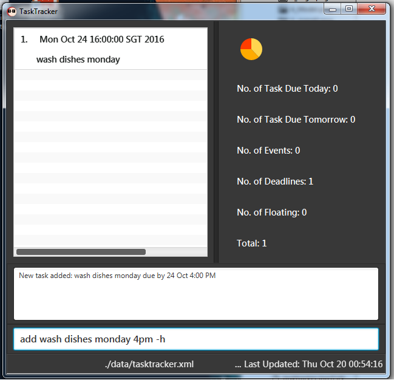
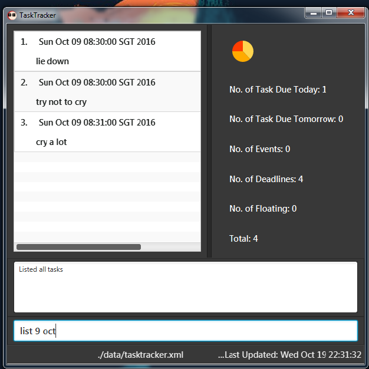
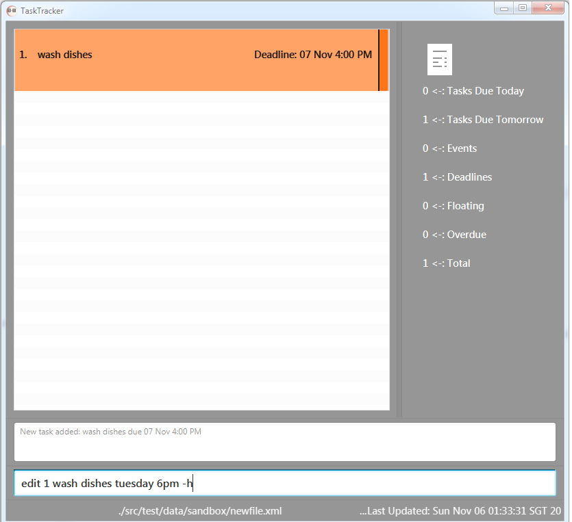
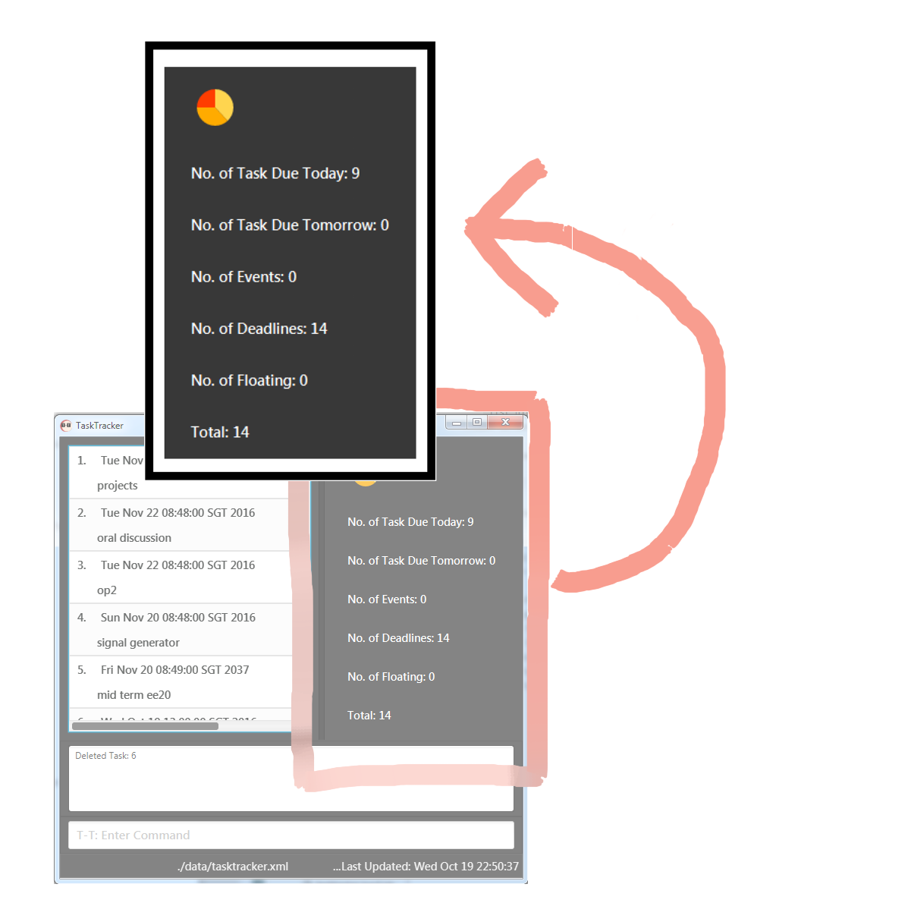
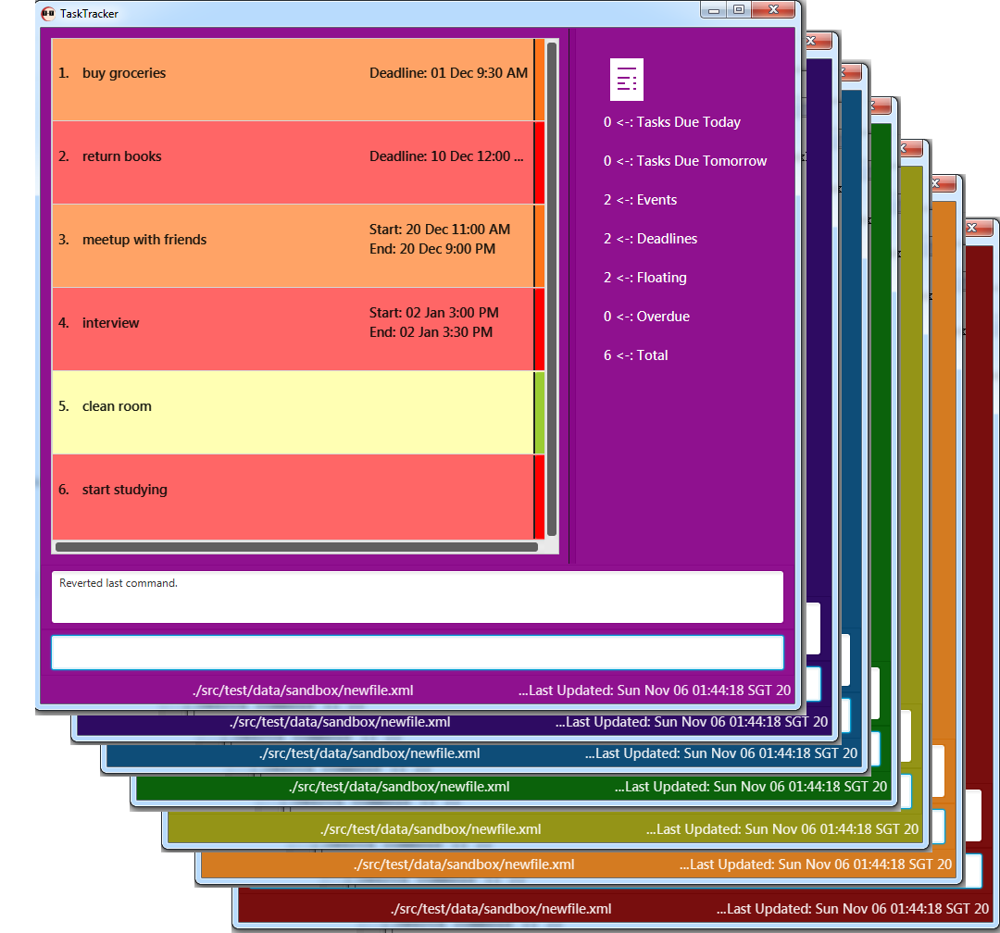

<!--@@author A0139422J -->

# **USER GUIDE** 
---
##**Contents**
*   [About](https://github.com/CS2103AUG2016-T09-C3/main/blob/master/docs/UserGuide.md#about)
*   [Quick Start](https://github.com/CS2103AUG2016-T09-C3/main/blob/master/docs/UserGuide.md#quick-start)
*   [Commands](https://github.com/CS2103AUG2016-T09-C3/main/blob/master/docs/UserGuide.md#commands)
    -   [ADD](https://github.com/CS2103AUG2016-T09-C3/main/blob/master/docs/UserGuide.md#1-add-a-task)
    -   [LIST](https://github.com/CS2103AUG2016-T09-C3/main/blob/master/docs/UserGuide.md#5-list-tasks)
    -   [DELETE](https://github.com/CS2103AUG2016-T09-C3/main/blob/master/docs/UserGuide.md#3-delete-a-task)
    -   [DONE](https://github.com/CS2103AUG2016-T09-C3/main/blob/master/docs/UserGuide.md#4-done-task)
    -   [EDIT](https://github.com/CS2103AUG2016-T09-C3/main/blob/master/docs/UserGuide.md#2-edit-a-task)
    -   [UNDO](https://github.com/CS2103AUG2016-T09-C3/main/blob/master/docs/UserGuide.md#6-undo)
    -   [REDO](https://github.com/CS2103AUG2016-T09-C3/main/blob/master/docs/UserGuide.md#7-redo)
    -   [SEARCH](https://github.com/CS2103AUG2016-T09-C3/main/blob/master/docs/UserGuide.md#8-search-for-tasks)
    -   [SORT](https://github.com/CS2103AUG2016-T09-C3/main/blob/master/docs/UserGuide.md#9-sort-tasks)
    -   [STORAGE](https://github.com/CS2103AUG2016-T09-C3/main/blob/master/docs/UserGuide.md#9-storage)
    -   [HELP](https://github.com/CS2103AUG2016-T09-C3/main/blob/master/docs/UserGuide.md#10-help)
*   [Unique Features](https://github.com/CS2103AUG2016-T09-C3/main/blob/master/docs/UserGuide.md#unique-features)
    -   [List Statistics](https://github.com/CS2103AUG2016-T09-C3/main/blob/master/docs/UserGuide.md#1-list-statistics)
    -   [Overdue Detection](https://github.com/CS2103AUG2016-T09-C3/main/blob/master/docs/UserGuide.md#2-overdue-detection)
    -  [Autocomplete](https://github.com/CS2103AUG2016-T09-C3/main/blob/master/docs/UserGuide.md#3-autocompletion)
    -   [Color Toggle](https://github.com/CS2103AUG2016-T09-C3/main/blob/master/docs/UserGuide.md#4-color-toggling)
    -   [Minimize window](https://github.com/CS2103AUG2016-T09-C3/main/blob/master/docs/UserGuide.md#5-minimize-window)
*   [Cheat Sheet](https://github.com/CS2103AUG2016-T09-C3/main/blob/master/docs/UserGuide.md#cheat-sheet)
*   [FAQ](https://github.com/CS2103AUG2016-T09-C3/main/blob/master/docs/UserGuide.md#faq)

## **About**

**_Task Tracker_ (T-T)** is an easy-to-use software which helps you manage your daily tasks. It is a simple and fun product which uses a creative Graphical User Interface to make the operations quick, easy and intuitive.

## **Quick Start**

**T-T** is easy to install and run.

> Ensure you have Java version `1.8.0_60` or later installed on your PC.

In order to install **T-T**, 

1.  Download the latest task-tracker.jar file from https://github.com/CS2103AUG2016-T09-C3/main/releases.
2.  Move the file to the directory in your computer where you want to install T-T.
3.  Double-click on the file to to start the app.

## **Commands**

**T-T** has a wide range of commands which can be used to add, delete, modify and manage everyday tasks. **T-T** supports 3 different kinds of tasks : 

1.  Event tasks (tasks with a start time and end time)
2.  Deadline tasks (tasks with a deadline)
3.  Floating Tasks (tasks with no start time, end time or deadline)

There are also 3 kinds of priorities which can be specified for each task- HIGH, NORMAL and LOW.

##### `<>` _indicates that field is compulsory_ and `[]` _indicates that field is optional._ 

### 1. **ADD**

You can use the ADD command to add tasks into **T-T**.

The format for adding a new task is:  
&nbsp; &nbsp;   `add <task> [date1] [date2] [-h | -m | -l]`  

<!-- @@author A0144132W -->
>>*  T-T can accept flexible date formats. Examples are:
    *  `today`
    *  `monday`(to set the date as next monday)
    *  `31 Oct`
*   If **no date** is specified, the task will be assumed to be a **floating task** which is an action whose deadline is indefinite.
*   If one or two dates are specified :
    *   If **one date** is written, it would be taken as the deadline.
    -   If **two dates** are written, they would be the start and end times for the task.
*   `[-h | -l]` refers to the priority of the task. 
    *   `-h` means **high** priority. The task will be coloured red.
    *   `-m` means **medium** priority. The task will be coloured orange.
    *   `-l` means **low** priority. The task will be coloured green.
    *   If not specified, priority is **medium**.
    
*   Except for `<task>`, the other parameters can be inputed in any order.

 For example: 
*   ` add wash dishes monday 4pm -h ` will create a high priority `wash dishes` task to be done on the **next Monday**.
 
 
*   ` add call mum tmr ` will create a task named `call mum` to be done anytime on **the next day** with **normal** priority. 

 

### 2. **LIST**

You can use the LIST command to list tasks according to different parameters such as  date, priority or tasks which are marked done.

The format to list tasks is :  
&nbsp; &nbsp; `list [date | priority | done |overdue]` 

>   *   The tasks will be shown based on the parameters specified. If no parameters given, the tasks are organized by **date**.
>   *   **done** parameter will list all the tasks marked done.
>   *   **overdue** parameter will list all tasks which are overdue.
>   *   Any number of parameters can be specified at the same time.

Tasks can be listed according to their priority, date when they are due or if they are marked as done.

  For example :  
* `list` will display all tasks organised by date.
* `list 9 Oct`  will display all tasks due on 9th October.
* `list high` will display all tasks of high priority.
* `list high today` will display all tasks of high priority due today.
* `list done` will display all the tasks marked done.
* `list done today` will display all the done tasks which were due today.
* `list overdue` will display all tasks which are overdue.

 
 

### 3. **DELETE**

You can use the DELETE command to delete existing tasks in **T-T**.

The format to delete an existing task is :  
&nbsp; &nbsp; `delete <task index>`  

>   *  `<task index>` is the number displayed alongside the task in the list panel.

  For example:  

Let’s say task index “**1**” refers to the task `wash dishes monday 4pm`

*   `delete 1` will delete the aforementioned `wash dishes` task.

<!--@@author A0142686X -->

### 4. **DONE**

You can mark tasks as done after they have been completed. Tasks marked as done will not appear in the main list, but can be viewed by the LIST command (see section 3.2).

The format to mark a task as done is :  
&nbsp; &nbsp; `done <task index>`  

>   *  `<task index>` can be obtained from the list panel.

  For example:  

Let’s say task index “**1**” refers to the task `do laundry monday 4pm`

*   `done 1` will mark the `do laundry` task as done.

### 5. **EDIT**

You can use the EDIT command to modify existing tasks in **T-T**.

The format to edit an existing task is :  
&nbsp; &nbsp; `edit <task index> <new task> [new date1] [new date2] [-h | -m | -l] `  

  * `<task index>` can be obtained from the list panel.

  For example:  

Let’s say task index “**1**” refers to the task `wash dishes monday 4pm`

 

*  `edit 1 wash dishes tuesday 6pm -h` will edit the existing `wash dishes` task to `use dishes` and change the date from **monday** to **tuesday** , time from **4pm** to **6pm** and priority from **medium** to **high**.
 
 
 
### 6. **UNDO**

You can use the UNDO command to revert the previous commands you have entered in the session.

The format to undo the previous command is simply : 
&nbsp; &nbsp; `undo`  

>>      Undo can be used to revert back add, delete, done, edit and clear commands.

  For example :  
Entering `undo` after executing the delete command will bring back the deleted task.

### 7. **REDO**

You can use the REDO command to redo the previous undo you have executed in the session.

The format to undo the previous command is simply : 
&nbsp; &nbsp; `redo`  

>>Redo can be used to revert back undos pertaining to add, delete, done, edit and  clear commands.

  For example :  
Entering `redo` after executing an undo for delete will delete the specific task again.

### 8. **SEARCH**

You can use the SEARCH command to filter out specific tasks from the entire list of tasks.

The format to search for certain tasks is :  
    `search <keyword>`  

>>•   The tasks you are looking for can be obtained by typing in any word that is contained within the tasks' messages.
•   If multiple tasks contain the entered keyword, all matching tasks will be displayed.

For example:  

Let say there is a task `wash dishes monday 4pm`

 
 
 

*   `search dishes` will show the existing `wash dishes` task.

 
 
 

### 9. **SORT** 

You can use the SORT command to sort tasks in the List Panel according to alphabetic order or date.

The format to sort a list of tasks is :  
&nbsp; &nbsp; `sort < date | name >` 

>   *   The tasks will be shown based on the parameters specified.

For example:
*   `sort date` will sort the list of tasks based on their dates, displaying the closest deadlines at the top.
*   `sort name` will sort the list lexicographically. 

 

### 10. **STORAGE** 

You can change the location of the xml file in which tasks are being stored in your PC.

The format to change storage location is :
     `storage <filepath>`  

The storage command can be used to change the storage location of tasks. Tasks are stored on your computer in an XML file.

>   *  Filepath must be of an XML file.
>   *  If the XML file mentioned at the filepath does not exist, a new XML file will be created by TaskTracker at the specified location.
>   *  All data of the pre-existing tasks will be copied to the new XML file.

  For example :  

Entering `storage C://users/JohnDoe/NewFile.xml` will change the storage location to NewFile.xml.

<!-- @@author A0139422J -->
### 10. **HELP**

You can use the HELP command for a list of all the commands and their parameters.

The format to use help command is to simply type : 
&nbsp; &nbsp; `help`  

The `help` command will open a window which lists all the available commands in T-T.

 
 
 
 
 

## **Unique Features**

**T-T** incorporates some unique features which differentiates it from the rest of the products in the market. These added features take T-T fun and easy to use!

### 1. List Statistics
**T-T**  provides an intuitive listing of the number of tasks stored, giving you a clearer idea on how to better deal with them. As seen in **the example below**, the numbers are displayed on the right of the task list. 

**T-T**'s list statistics provides data on all the different types of tasks available in storage:

* Today's Tasks 
* Tomorrow's Tasks
* Event Tasks (Tasks with two dates specified)
* Deadline Tasks (Tasks only one date specified)
* Floating Tasks (Tasks with no date specified)  
* Overdue Tasks (Tasks whose date has passed)
* Total Tasks 

 
 

### 2. Overdue Detection
Apart from the three basic colors shown earlier to indicate different priorities, **T-T** uses black tabs to indicate which tasks are overdue. If the current time has overshot an event task's endtime or a deadline task's deadline, the corresponding task will be shown with a black tab, as shown below. 

 
 
 

### 3. Autocomplete
Users who find typing in the many commands **T-T** provides too tedious may opt to use the autocomplete function the app has as well. Simply press the `Tab` key and you will be able to cycle through all the different commands. 

If you already have a command in mind, simply type the first letter of the command and press TAB. Autocomplete will fill out the rest of the command.

For example:  

Let say you were to enter a letter `d` in the **T-T** command box, by pressing `Tab`, the following commands can be toggled to easily.

*   `delete`
*   `done`

However, the autocompletion does not stop there. Sometimes users do need to reenter past commands. By pressing the `UP` and `DOWN` arrow keys, you can also access your most recent commands without having to tediously type it out again. 

### 4. Color Toggle
The user interface is not just limited to just one color. **T-T** offers you a variety of seven color themes to choose from. 

By pressing `F1` and `F2`, you can toggle between the different themes and choose any which suit your liking. 

 
 
 

### 5. Minimize Window
Once you are done with adding and modifying tasks in **T-T**, you can simply press `Esc` to minimize the window.

<!-- @@author A0139750B -->
## **Cheat Sheet**
Getting the hang of it? Here’s a quick and dirty summary of all **T-T** commands and keyboard shortcuts.

| Commands  | Function  | Usage  |
|---|---|---|
| add  |  Adds a new task to the list | `add question life 14 Oct 1045 -l` |
| edit  | Edits an existing task  | `edit 1 review UG tuesday 10am -h`  |
| delete  | Deletes an existing task  |  `delete 1`    |
| done  | Marks a task as done | `done 1` |
| list  | Sorts and displays the list of existing tasks  | `list high today` |
| undo  | Undoes the previous command  | `undo` |
| redo  | Redoes the previous undo | `redo` |
| search  | Searchs for tasks that contain a designated keyword  | `search meaning` |
| sort  | Sorts the list of tasks by date or lexicographically | `sort date` |
| storage | Changes the location of the XML file in which tasks are stored |`storage C://Users/Desktop/newfile.xml` |
|  help | Displays the list of commands available on T-T  |  `help` |

 
 

| Keyboard Shortcuts  | Function  |
|---|---|
| `UP`/`DOWN`   |  Toggles history of recent commands  |
| `F1`/`F2`  | Toggles **T-T** color theme |
| `PgUp`/`PgDn`  | Navigates the list of tasks |
| `Tab`  | Autocompletes user input |
| `Esc`  | Minimizes app |

## **FAQ**

**Q**: __How do I transfer my data to another Computer?__

**A**: Install the app in the other computer and overwrite the empty data file it creates with the file that contains the data of your previous Address Book folder.  
 
**Q**: __How do check if I have the correct Java Version?__ 

**A**:  
     1. Click Start on the task bar. 
     2. Select Control Panel (or Settings > Control Panel) from the Start menu. The Control Panel is displayed. 
     3. Select Java. The Java Control Panel dialog box is displayed.
     4. NOTE: if the Control Panel is in Category mode and you cannot see the Java option, switch the Control Panel to Classic View. 
     5. Click the Java tab. 9 of 9 6. In the Java Application Runtime Setting box, click View. The JNLP Runtime Settings dialog box is displayed.
     6. In the Java Application Runtime Setting box, click View. The JNLP Runtime Settings dialog box is displayed.
 

If you encounter any further issues using T-T, please contact us at:
    **tasktrackerT-T@gmail.com**

